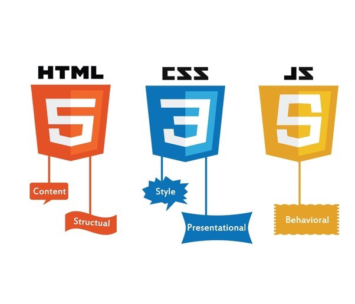
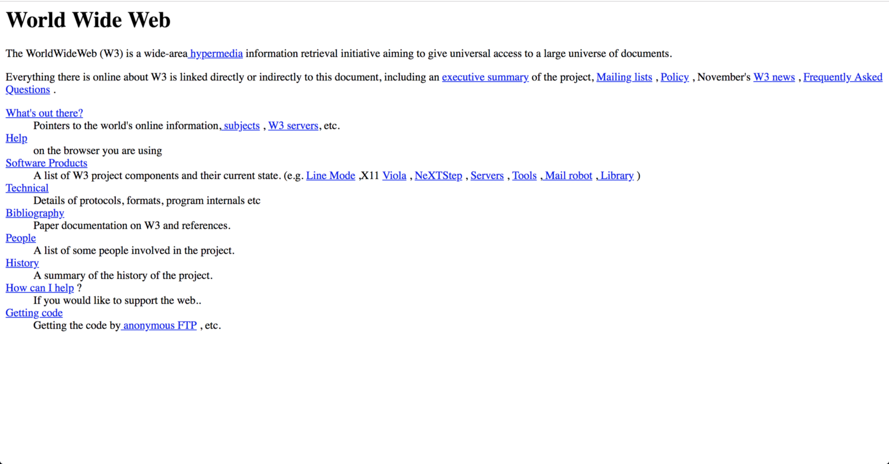
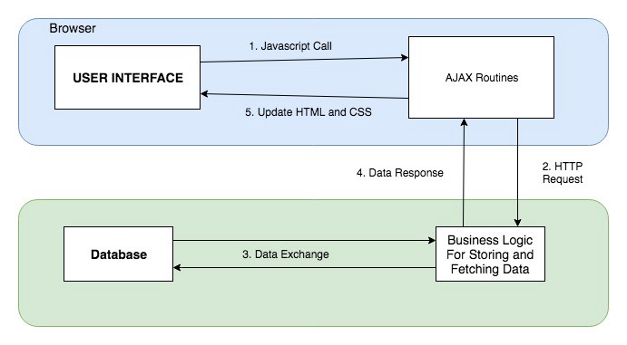
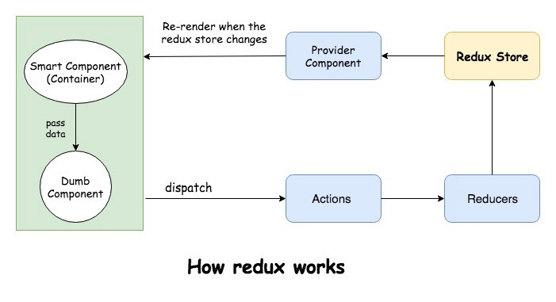
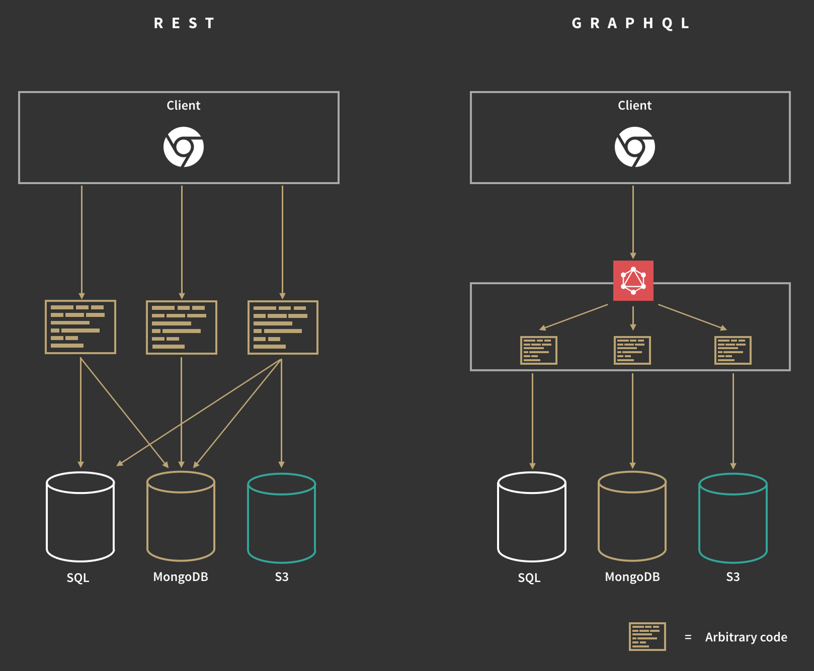
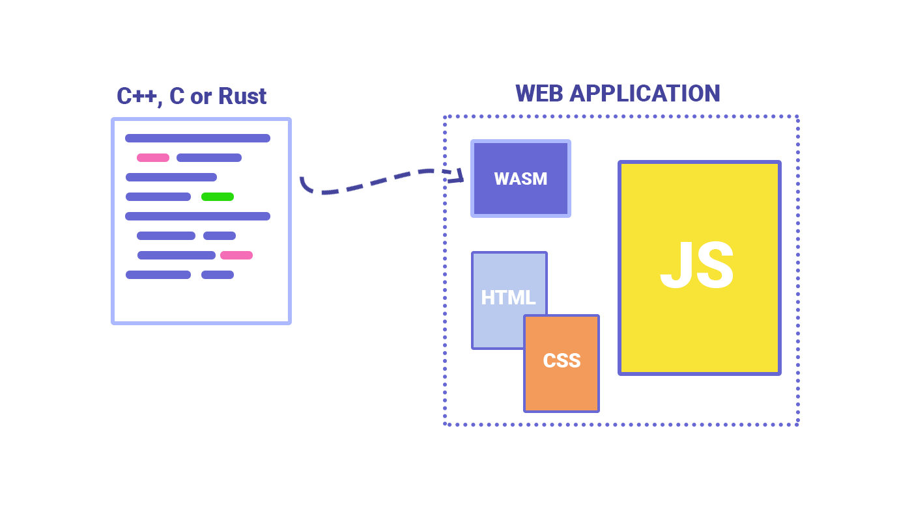

[HTML](https://en.wikipedia.org/wiki/HTML), [CSS](https://en.wikipedia.org/wiki/Cascading_Style_Sheets), and [Javascript](https://developer.mozilla.org/en-US/docs/Learn/JavaScript/First_steps/What_is_JavaScript) are the core technologies of the Web. This blog intends to tell some facts about the web and its technologies since inception, along with some answers to commonly asked questions.

### 1980–1990


_Tim Berners-Lee_ built _ENQUIRE_ (predecessor of World Wide Web), as a personal database of people and software models with hypertext linking each page to existing page. In 1990 Tim started implementing a large hypertext database with typed links (World Wide Web) when _The Web_ world was born. Tim built all the necessary tools for making the web work, HTML, the first web browser (_a web editor_) and the first web server.

While no original copy of the website remains, an updated version can be [found here](http://www.w3.org/History/19921103-hypertext/hypertext/WWW/TheProject.html).



### 1991–1994

-   Mosaic became the first browser to allow images embedded in text making it the world’s first most popular browser.
-   W3C was established in order to maintain the international standards of WWW.
-   Yahoo website released.

> _What is a web browser?_

A **web browser** is a software application for accessing information on the World Wide Web. Each individual web page, image, and video is identified by a distinct URL, enabling browsers to retrieve and display them on the user’s device.

> _How do web browsers work?_

1.  Enter the website URL in the address bar.
2.  The browser will locate and requests the page information from a web server.
3.  The browser will receive HTML, CSS and JS files which include the content to be displayed, presentation information of the content and actions to be performed on events fired by the user.
4.  The browser will interpret the files and display the page.

If you need a more detailed technical breakdown of how the browser works, behind the scenes refer [**_here_**](https://www.html5rocks.com/en/tutorials/internals/howbrowserswork/).

### 1995

1.  HTML 2.0 was released as the first HTML specification intended to be treated as a standard against which future implementations should be based.
2.  **Javascript** was released by Netscape for browsers.
3.  DOM Level 0 used in the browsers.
4.  Browsers: Internet Explorer made its debut as Microsoft’s first web browser. Netscape Navigator 2.0 was released.
5.  Amazon (online book shop) and eBay websites were launched.

### 1996

1.  CSS support for font properties, the colour of text, backgrounds, alignments, margins etc. was released.
2.  Microsoft’s JScript released for ASP and .NET pages.

### 1997

**HTML 4.0** was published as a W3C Recommendation. ECMAScript 1 released which contained implementations of ActionScript, JScript, Javascript. Popular browsers were Internet Explorer 4.0, Netscape Navigator 4.0.

### 1998

> _What is DOM?_

The DOM is just a programming interface which gives you the ability to access the Document(webpage) and do operations over it/manipulate it. It basically, connects your scripting language to the Document(webpage).

-   Many new features were added to the core technologies of the World Wide Web.
-   Google website was launched.

1.  HTML 4.0 was reissued with minor edits without incrementing the version number.
2.  **CSS 2.0** included a number of new capabilities like absolute, relative, and fixed positioning of elements, z-index, etc.
3.  Editorial changes to ECMAScript 2.0.
4.  **DOM Level 1** provided a complete model for an entire HTML or XML document, including the means to change any portion of the document.

### 2000

DOM Level 2 was published. It introduced the `getElementById` function as well as an event model and support for XML namespaces and CSS.

### 2000–2004

DOM Level 3 was published. It added support for XPath and keyboard event handling, as well as an interface for serializing documents as XML. During this period JavaScript was only used in the traditional web applications only when needed.

> _What is MPA?_

Traditional Web Application (Multi-page Applications)

1.  It consists of several pages with static information (text, images, etc) and links to the other pages.
2.  During a jump to another page, a browser reloads the content of a page completely and downloads all resources again.
3.  Every time the application needs to display the data or submit data back to the server it has to request a new page from the server and then render it in the web browser. This approach is useful for a simple website and mainly static pages. If the UX is rich the complex pages generation is time-consuming.
4.  Simple SEO optimization by optimizing every single page for search engines.

<Embed src="https://codepen.io/swap2993/embed/preview/QzJapM?height=600&slug-hash=QzJapM&default-tabs=css,result&host=https://codepen.io" aspectRatio={undefined} caption="Todo app with Javascript." />

_Browsers:_

1.  Apple’s Safari browser was released specifically for Macintosh computers instead of Navigator in 2003.
2.  In 2004, Mozilla launched Firefox as Netscape Navigator faded out.

### 2005

> _Benefits of AJAX?_



This year was revolutionary when the AJAX concept turned out to be the way of building modern websites. Because of AJAX we can:

-   Update a web page without reloading the page
-   Request data from a server after the page has loaded.
-   Receive data from a server after the page has loaded.
-   Send data to a server in the background.

Due to this, there was a shift from desktop applications to web applications.

### 2006

Sass, a preprocessor scripting language that is interpreted or compiled into Cascading Style Sheets (CSS) was released.

The _jQuery_ library was released which tried to fix javascript missing features. jQuery is a lightweight, “write less, do more”, JavaScript library. It helps in

-   HTML/DOM manipulation;
-   CSS manipulation;
-   HTML event methods;
-   Effects and animations;
-   AJAX;

Commonly known as the _Swiss knife of Javascript._

Todo example with Jquery Github [link](https://github.com/swapnil2993/js-evolution-with-demo-samples/tree/master/JQUERY).

<Embed src="https://codepen.io/swap2993/embed/preview/EGOobr?height=600&slug-hash=EGOobr&default-tabs=css,result&host=https://codepen.io" aspectRatio={undefined} caption="" />

### 2007–2009

Browsers: Google Chrome 1.0, Mozilla Firefox 3, Opera 9.5, etc.

More and more web applications were developed during this phase. The UX had to improve in order to make end users keep using web applications. UX started getting more and more complex asking for more interactions on the web. So the traditional web way (_MPA_) was becoming more complex.

The Web world was going to go through a major change. Chrome and Firefox started to lead the browsers in making them better. Important events that benefited the web.

-   **ECMAScript 5** was released which included important features like _strict_ mode and JSON support.
-   **Canvas 3D** project aims to add support for low-level hardware accelerated (where possible) 3D rendering via the HTML canvas element.
-   **_SPA_ design pattern** started getting more traction.
-   Javascript language can also work on server side. Node was released which was based on CommonJs.

> _What is a SPA?_

Single-page Applications (SPA)

A single-page application is an app that works inside a browser and does not require page reloading during use. It is just one web page that one visits which then loads all other content using JavaScript which they heavily depend on.  
Single page apps are distinguished by their ability to redraw any part of the UI without requiring a server roundtrip to retrieve HTML. This is achieved by separating the data from the presentation of data by having a model layer that handles data and a view layer that reads from the models. Advantages of using this pattern were faster page loading times, separation of frontend and backend development.

---

### 2009–2015

Important Events:

-   LESS CSS pre-processor released in 2009.
-   **Bootstrap** is a free and open-source front-end framework for developing websites and web applications.
-   **TypeScript** originated from the shortcomings of JavaScript for the development of large-scale applications both at Microsoft and among their external customers. The typescript was made public in 2012 by Microsoft.
-   **HTML5** released in 2014 with features like Canvas, WebStorage, Indexdb, History API, etc. For more details on the HTML5 Guide refer [here](https://developer.mozilla.org/en-US/docs/Web/Guide/HTML/HTML5).
-   **WebGL** (**Web Graphics Library**) is a JavaScript API for rendering interactive 2D and 3D graphics within any compatible web browser. It has evolved from the Canvas3D project.
-   ECMAScript 6 (**ES6, ES2015**) released in 2015 which aimed at fixing the bad parts of javascript like the lexical **“this”** with **\=>**(arrow) functions. Refer [_here_](http://es6-features.org) for all the features of ES6.

Questions Answered:

> _What are the benefits of the History API?_

> _Why the need for modules in javascript?_

> _Why the need for bundling tools?_

---

-   [_History API_](https://developer.mozilla.org/en-US/docs/Web/API/History_API) of HTML5 gives developers the ability to modify a website’s URL without a full page refresh. This is particularly useful for loading portions of a page with JavaScript, such that the content is significantly different and warrants a new URL.
-   The rise of _SPA_ made way gave birth to many JS frameworks/libraries like AngularJS, BackboneJs, EmberJS, etc. These frameworks became the backbone of Modern Web Applications.


Due to the growing complexity of UX, Javascript related code started getting more complex and messy. For writing better applications the code needs to be modular. But the Javascript in browser did not have the concept of modularity like Node.

```
<script src="https://code.jquery.com/jquery-2.1.4.min.js"></script>
<script src="https://somecdn/ajax/libs/troublesome.js"></script>
<script src="the-rest-of-my-js.js"></script>
```

Before the rise of modern JS frameworks, the way of importing scripts had the following drawbacks:

1.  Every piece of code is made global by default. Global namespace gets polluted with a lot of global variables by 3rd party libraries and then your own libraries. (_We can wrap it inside the closure_).
2.  Load order matters, because anything can overwrite or change anything else. Dependencies are hidden from our scripts. We need to assume the necessary scripts have been loaded before consuming them in our script.
3.  Files and modules do not have any meaningful connection. Third party dependencies among each other need to be managed manually. For example: If you load two versions of jQuery one will “win”. If you load two versions of the Bootstrap CSS framework they will both apply simultaneously and wreck your styling.

Javascript modules advantages:

-   Packages expose a single public interface and do not leak global namespace.
-   Ordering does not matter anymore.
-   Implementation details are inaccessible outside the package.
-   Node module loader allows you to have multiple, incompatible versions of the same module to be present at the same time, and one of the joys of _npm_ is that it puts these versions into the right places so that the version you were expecting gets loaded where you expected it.
-   We should be able to create packages that encompass multiple files and directories and be able to wrap full subsystems into a single closure. Doing this manually will be a huge problem. This is were bundling tools like Bower (deprecated), Browersify, [Webpack](https://webpack.js.org/) were born.

```
// CommonJS
require ('lodash')
console.log(_);

// ECMA6
import 'lodash'
console.log(_);
// Notice currently you need to transpile ECMA6 import using for example Babel to make it run in browsers
```

> _What do modern javascript frameworks/libraries solve?_

Today almost everyone is using React.js/Angular/VueJS for frontend development. But why do I need to use these frameworks when I have the swiss knife (jQuery) with me. The advantages of using these libraries/frameworks are:

-   _The most important one is these libraries help in keeping the UI in sync with the internal state of the application._
-   Reusable Components.
-   They have a strong community and thus have plenty of third-party libraries to deal with things.
-   Browser extensions that help to debug things easily.
-   Good for doing _SPAs_.

[https://codepen.io/swap2993/pen/KbrZQQ](https://codepen.io/swap2993/pen/KbrZQQ)

---

### 2015-Present

Important Events

-   Microsoft Edge was born to combat Google in 2015.
-   Firefox Quantum released in 2017 which is said to be more faster than Chrome.
-   **ECMA 2016** released in 2016 with important updates like `async/await.` Details can be referred [here](http://www.ecma-international.org/ecma-262/7.0/index.html).
-   [**Bootstrap 4.0**](https://getbootstrap.com/docs/4.0/getting-started/introduction/) released in 2017, added support for Sass and Flexbox. Bootstrap is currently the most popular CSS framework. It’s more popular with developers who want to quickly prototype a great looking web interface.
-   ECMAScript modules in browsers.

```
<script type="module">
  import { addTextToBody } from './index.js';
  addTextToBody('The modules implementation in browsers is      working.');
</script>
```

-   State management tools like flux, redux were born.

**Redux** is a predictable state container for JavaScript applications. It helps you write applications that behave consistently, run in different environments (client, server, and native), and are easy to test.



-   [**StoryBook**](https://storybook.js.org/) **is** a UI development environment and playground for UI components. The tool enables users to create components independently and showcase components interactively in an isolated development environment.
-   **Progressive web applications** (**PWAs**) are web applications that load like regular web pages or websites but can offer the user functionality such as working offline, push notifications, and device hardware access traditionally available only to native applications. PWAs combine the flexibility of the web with the experience of a native application.
-   **GraphQL** emergence for data-driven application of moderate complexity is a merit primary consideration.

> _What is GraphQL?_

GraphQL is a query language created by Facebook in 2012 (open sourced in 2016) which provides a common interface between the client and the server for data fetching and manipulations. This led to the birth of BFFs (_Backend for Frontend developers_) who will write code for requesting the specific data to be displayed on the web. Best tutorial for getting started with Graphql is [how to GraphQ](https://www.howtographql.com/)L.



-   **WebAssembly (Wasm)** is designed as a portable target for compilation of high-level languages like C/C++/Rust, enabling deployment on the web for client and server applications.  It can be run in modern web browsers and provides new features and **major gains in performance**.



-   **Accelerated Mobile Pages (AMP)** is a feature developed on open source medium and approved by Google to improve the page-loading performance of web pages. It generates an outstandingly fast browsing experience on mobiles. AMP is simple as it contains 10 times fewer data than a usual website or app. It thus helps to get informative content in front of users in the shortest possible time.
-   Building Augmented Reality and Virtual Reality applications along with Web Technologies. React 360 is a project for creating VR experiences with React.

### Future

-   [**Deno**](https://deno.land/) is a secure TypeScript runtime built on V8. Possible replacement of Node.js.
-   [**Servo**](https://servo.org/) is a modern, high-performance browser engine designed for both application and embedded use. [Parallelism is the future of browser](https://www.youtube.com/watch?v=gfaV-OUR6w0) is a great talk given by Lin Clark on future on browsers.
-   Static site generators are becoming a trend. Examples like Next.js and Gatsby that use React are popular.
-   Each and every library/framework built along with the core technology helps it to improve even more.
-   The developer community will continue improving HTML, CSS, Javascript, and Browsers over the coming years.

---

_References:_

-   [https://www.wikipedia.org/](https://www.wikipedia.org/)
-   [http://singlepageappbook.com/](http://singlepageappbook.com/)
-   [https://medium.com/dailyjs/the-deepest-reason-why-modern-javascript-frameworks-exist-933b86ebc445](https://medium.com/dailyjs/the-deepest-reason-why-modern-javascript-frameworks-exist-933b86ebc445)
-   [https://blog.apollographql.com/graphql-explained-5844742f195e](https://blog.apollographql.com/graphql-explained-5844742f195e)
